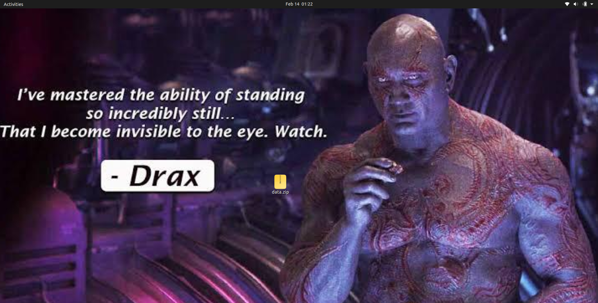
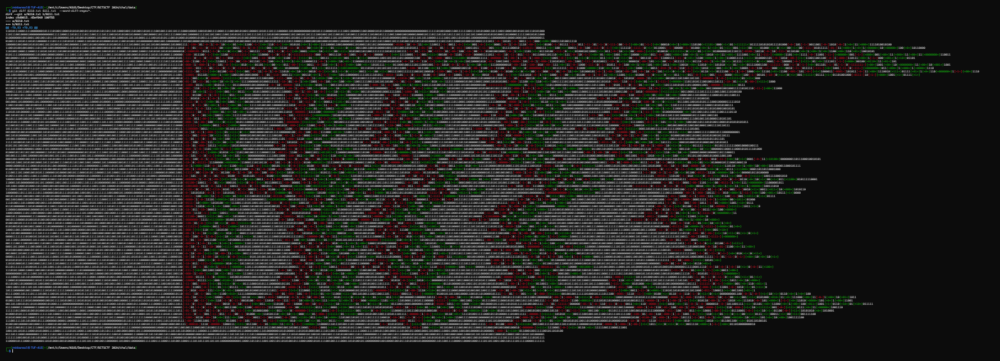

# Binary Zoetrope
## Description
I mananged to invade MogamBro's PC & got a sneak peak of his desktop...  
Find out what data he is hiding!



> rskbansal & Pamdi

## Files
[**data.zip**](./data.zip)

## Solution
- We are given with a zip which contains a lot of binary text files.
- Using the diff command, we can see that the consecutive files are almost similar with a few bits being changed & it tries to form a word.

    ```bash
    git diff 0210.txt 0211.txt  --word-diff-regex=.
    ```

    
- Also the title says `Zoetrope`, which is a device that produces an illusion of motion from a rapid sequence of static images.
- The above 2 hints suggest that we need to combine all the text files in form of images to make a video/animation.
- Using the below python script, we create the `output.mp4` video.

## Flag
Seeing the video, we get the flag as the text scrolls from right to left.
```
BITSCTF{n0w_u_c_m3}
```

## Author
[**@rskbansal**](https://github.com/rskbansal)  
[**@Pamdi**](https://github.com/Pamdi8888)