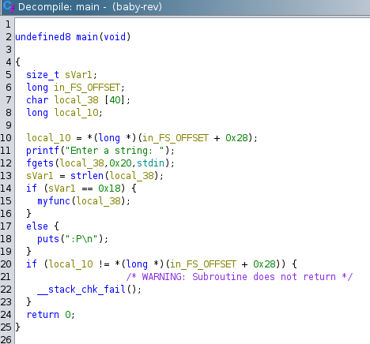
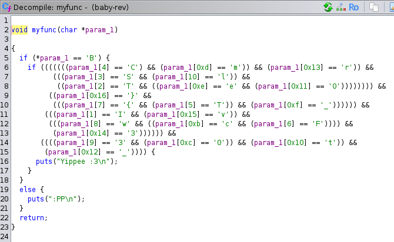

# baby-rev
## Description

```
anita max wyinn
```

## Solution
The program asks for a string and enters :P. Dissabssembling in ghidra, we get



<br>
The function checks the input length and redirects to another function myfunc, which contains


<br>
It looks like the flag is just simply rearranged, we can copy this to our editor and assemble the flag.


## Flag

```
BITSCTF{w3lc0me_t0_r3v}
```

## Author
[**@arm44n**](https://github.com/arm44n)