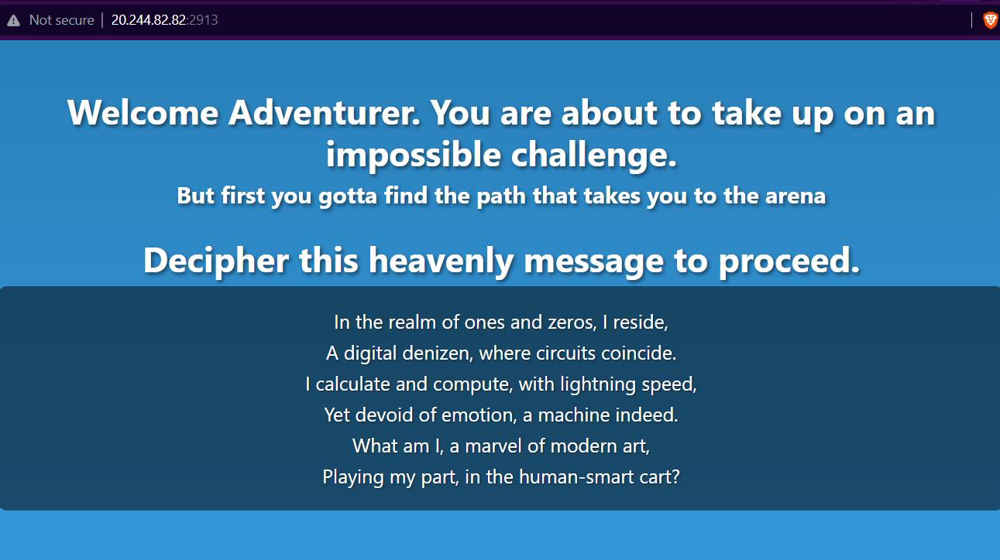
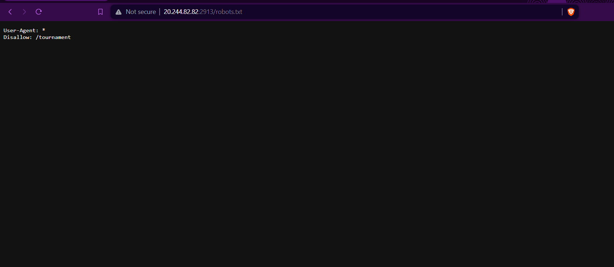
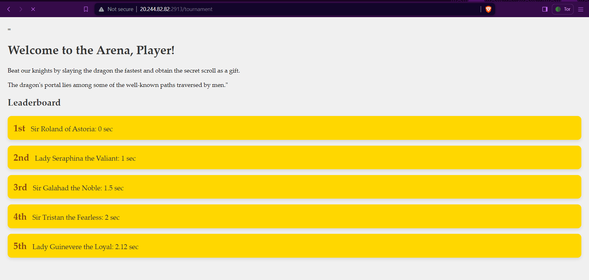
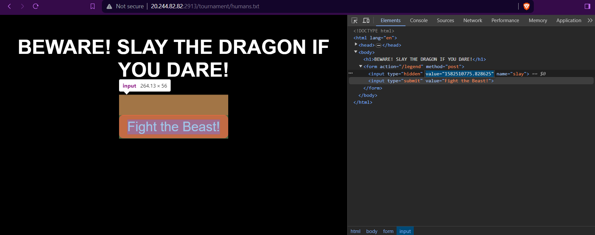

# Conquest

**Category:** Web  
**Difficulty:** Easy

## Description

Our Mogambro is a lucid dreamer who has meticulously replicated one of his sessions in the form of the given website. Can you also complete the quest which Mogambro failed to do?

## Link 

http://20.244.82.82:2913/

## Solution

This challenge was divided into 3 parts. The first webpage presents a riddle that would lead you to another file path. The answer to the riddle is "robots". Thus one could decipher that the path in fact is `robots.txt`.



Once you access the `robots.txt` file, you would find a file path `/tournament` that would lead to the next webpage.


Here you see the following webpage:



As the first line suggests you have to beat the dragon faster than 0 seconds in order to win. This would come handy later on.

The second line hints at the use of directory fuzzing to search for all the well-known file paths or directories. Using `diresearch` or any other fuzzer one can find the following file path: `/tournament/humans.txt`.

This is where the main challenge lies.


As you can see in the image the webpage has a form that has a hidden input parameter with a Linux epoch time value. On decoding one finds out that it refers to a time in the past. When you submit the form, the webpage checks if the time is less than 0 seconds(this is where the hint given in the previous webpage is used).It would not be in this case.So you have to think of a way to change the form value to a future epoch time.

Here is a python script that would do the job for you:

```python
import requests

url = "http://20.244.82.82:2913/legend"
data = {"slay": '1882510775.828625'}
response = requests.post(url, data=data)
print(response.text)
```

Alternatively, you could use Burp Suite to intercept the request and change the value of the hidden input parameter to a future epoch time.

##Flag
The flag is: __BITSCTF{7HE_r341_7r345Ur3_W45_7H3_Fr13ND5_W3_M4D3_410N6_7H3_W4Y}__

Hope you enjoyed the challenge :).

##Author
[@DarthLazius](https://github.com/darthlazius)